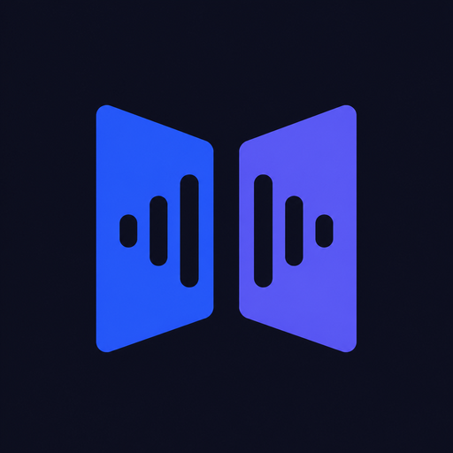
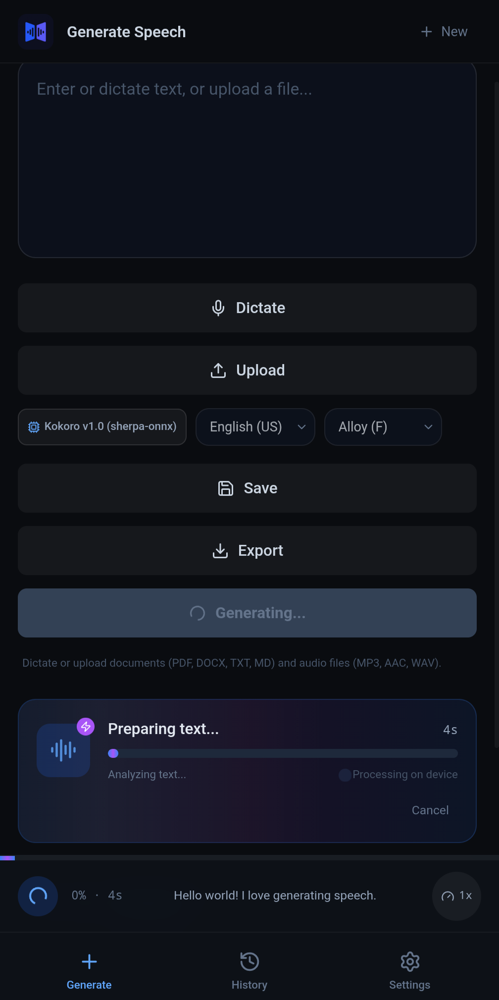
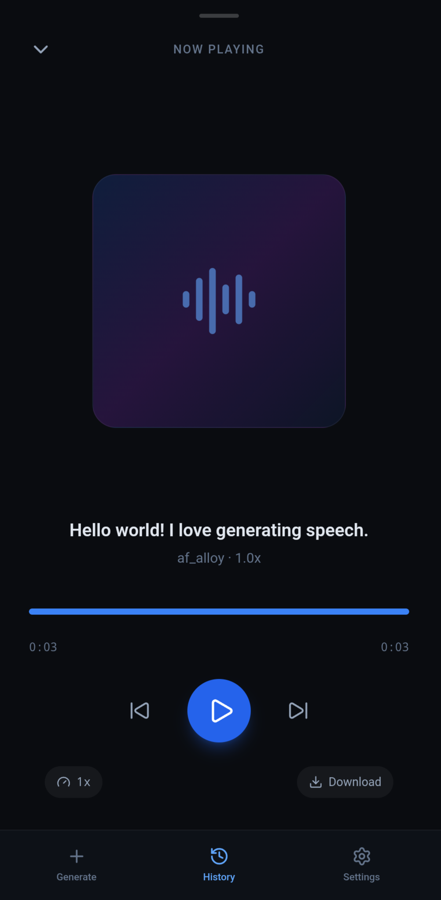
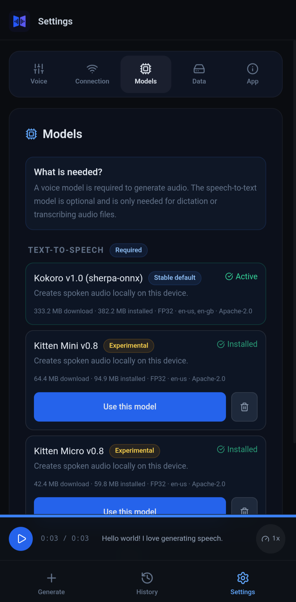
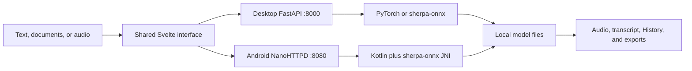

<p align="center">
  
</p>

<h1 align="center">Open Mobile TTS</h1>

<p align="center">
  <strong>Private speech generation and transcription for desktop and Android.</strong><br>
  Turn text and documents into audio, dictate or transcribe recordings, and
  keep the entire workflow on hardware you control.
</p>

<p align="center">
  <a href="https://www.buymeacoffee.com/chrissotraidis"></a>
</p>

<p align="center">
  <a href="https://github.com/chrissotraidis/openmobiletts/actions/workflows/desktop-ci.yml"></a>
  <a href="https://github.com/chrissotraidis/openmobiletts/actions/workflows/android-ci.yml"></a>
  
  
  
  
  <a href="LICENSE"></a>
</p>

Open Mobile TTS is a local-first workspace for reading, writing, listening, and
transcribing. The desktop edition starts one private web interface on your
computer. The Android edition, labelled **OMTTS** beneath the launcher icon,
runs its models directly on the phone through sherpa-onnx. There are no
accounts, cloud speech APIs, or API keys.

After model download, speech content stays on the device running the app. The
desktop server binds to loopback by default, and Android serves its shared UI
from an app-internal loopback server.

## Install status

| Option | Status | What to do |
|---|---|---|
| Android signed APK | **Preview available** | [Download v3.1.0-preview.1](https://github.com/chrissotraidis/openmobiletts/releases/download/v3.1.0-preview.1/open-mobile-tts-v3.1.0-preview.1.apk) and install it directly on Android 8.0 or newer. |
| Desktop local web app | **Available now** | Clone the repository and run `python3 run.py`. |
| Android source build | **Available now** | Developers can build the debug APK with Android Studio or Gradle. |
| Play Store | **Not published** | The preview is distributed only through GitHub Releases. |
| Browser-installed PWA | **Not supported** | The browser UI requires the local Python or Android backend. |
| iPhone / iPad | **Planned** | No iOS or iPadOS application exists yet. |

The signed Android APK is a public preview, not a stable or Play Store release.
It has passed strict builds, emulator updates, and a physical Pixel 9 Pro XL
model cycle. The wider low/mid-range hardware, fresh-download, background,
interruption, and thermal matrix is still open.

## Get started on desktop

### Requirements

- Python 3.10, 3.11, or 3.12
- Node.js 20 or 22 LTS
- `espeak-ng`
- `ffmpeg`

On macOS:

```sh
brew install espeak-ng ffmpeg
```

Clone and launch:

```sh
git clone https://github.com/chrissotraidis/openmobiletts.git
cd openmobiletts
python3 run.py
```

Open [http://localhost:8000](http://localhost:8000).

The launcher creates a repository-local `.venv`, installs the pinned Python
and JavaScript dependencies, builds the shared interface, and reuses the
isolated environment on later runs. The first Kokoro use downloads roughly
320 MB of model data into the Hugging Face cache.

### Docker

```sh
docker compose up --build
```

Docker serves the same local interface and persists the Hugging Face model
cache. It does not turn Open Mobile TTS into a hosted or authenticated service.

## Install on Android

### Install the signed APK

You need Android 8.0 or newer and at least 1.2 GB of free space for the app,
downloaded model archive, verification, and staged installation.

1. On the Android device, download
   **[open-mobile-tts-v3.1.0-preview.1.apk](https://github.com/chrissotraidis/openmobiletts/releases/download/v3.1.0-preview.1/open-mobile-tts-v3.1.0-preview.1.apk)**.
2. Open the downloaded APK from the browser or **Files** app.
3. If Android asks, allow that browser or Files app to **Install unknown apps**.
   This permission can be turned off again immediately after installation.
4. Confirm **Install**, allow Play Protect to scan the APK if offered, then open
   **OMTTS**.

The release also includes a
[SHA-256 checksum file](https://github.com/chrissotraidis/openmobiletts/releases/download/v3.1.0-preview.1/open-mobile-tts-v3.1.0-preview.1.apk.sha256).
The APK is signed with the project's dedicated release identity so future
GitHub APKs can update it in place.

If Android reports **App not installed** and you previously built OMTTS from
source, the old debug build has a different signing identity. Export a History
backup if needed, uninstall the debug build, then install the GitHub APK.
Uninstalling removes that installation's private models and local app data.

### First launch

1. Open **OMTTS**.
2. Download the required 333.2 MiB Kokoro voice-model archive. Allow additional
   temporary space for verification and staged installation.
3. Enter or dictate text, or upload a supported document.
4. Choose a language and voice, then press **Generate**.
5. Open the player or History to listen, seek, replay, and download audio.
6. Open **Settings > Models** only if you want optional speech-to-text or an
   experimental compact voice model.

Kokoro is the recommended Android voice model. Kitten Mini and Micro are
smaller developer-preview experiments with noticeably less reliable output.
They are optional, clearly labelled **Experimental**, and can be removed when
inactive.

### Build the debug APK from source

Developers need Android Studio with Android SDK/API 36 and build tools 36.0.0,
JDK 17 or newer, Node.js 20 or 22 LTS, and USB debugging for command-line
installation.

```sh
git clone https://github.com/chrissotraidis/openmobiletts.git
cd openmobiletts/android
./gradlew :app:assembleDebug --dependency-verification strict
adb devices
adb install -r app/build/outputs/apk/debug/app-debug.apk
```

You can also open the `android/` directory in Android Studio, select a device,
and press **Run**. Debug builds are for development and do not share the public
APK's signing identity.

See the complete [Android build and runtime guide](android/README.md) for model
integrity, storage, architecture, and current test evidence.

## Current Android experience

<table>
  <tr>
    <td width="33%">
      
    </td>
    <td width="33%">
      
    </td>
    <td width="33%">
      
    </td>
  </tr>
  <tr>
    <td align="center"><strong>Generate locally</strong><br>Type, dictate, or import content and follow on-device progress.</td>
    <td align="center"><strong>Listen without leaving</strong><br>Seek, replay, change speed, and download from the focused player.</td>
    <td align="center"><strong>Control model storage</strong><br>Keep Kokoro stable and add or remove experimental models explicitly.</td>
  </tr>
</table>

These captures come from the current physical Android build. The Models screen
shows the stable Kokoro default plus optional Kitten Mini and Micro downloads.

## What works

| Area | Desktop | Android |
|---|---|---|
| Text-to-speech | Kokoro 82M through PyTorch; optional sherpa-onnx backend | On-device Kokoro through sherpa-onnx; 28 accepted English US/UK voices |
| Unified input | Text, dictation, PDF, DOCX, TXT, Markdown, and supported audio | Text, dictation, documents, and bounded audio import |
| Player and History | Persistent player, reader, queue, History, and local audio cache | Shared mobile player, History, lock-screen controls, and recovery for long jobs |
| Speech-to-text | Optional Moonshine v1 Base English INT8; desktop batch jobs supported | Optional Moonshine v1 Base English INT8; initialized only when requested |
| Model management | Pinned desktop STT installer and selectable TTS backend | Verified WorkManager downloads, progress, pause/resume, model selection, and safe clean-process switching |
| Export and backup | Audio, text, Markdown, PDF, logs, and History backup/restore | Audio download, text export, logs, and History backup/restore |
| Privacy defaults | Loopback server, local inference, metadata-only text logging | App-private model/data storage and loopback-only WebView bridge |

Android transcription is bounded to 15 minutes and 256 MiB during this
stabilization cycle. Desktop batch transcription is intentionally hidden on
Android through the shared capability contract.

## Models and download sizes

| Purpose | Model | Download / installed size | Product status |
|---|---|---:|---|
| Desktop TTS | `hexgrad/Kokoro-82M` | About 320 MB cache | Default desktop voice model |
| Android TTS | `kokoro-multi-lang-v1_0` | 333.2 MiB / 382.2 MiB | Stable Android default |
| Android TTS | Kitten Mini v0.8 | 64.4 MiB / 94.9 MiB | Experimental, English, eight voices |
| Android TTS | Kitten Micro v0.8 | 42.4 MiB / 59.8 MiB | Experimental, English, eight voices |
| Desktop / Android STT | `sherpa-onnx-moonshine-base-en-int8` | 239.2 MiB / 274.4 MiB | Experimental English transcription |

The current speech-to-text model is **Moonshine v1 Base English INT8**, not
Moonshine v2 Medium. There is no transcript-correction LLM in the application.
Model identity, checksums, licenses, languages, and required files are recorded
in the [model provenance ledger](docs/MODEL_PROVENANCE.md) and shared
[`model-catalog.v1.json`](models/model-catalog.v1.json).

## How it is built



Desktop and Android intentionally use different native backends behind one
versioned capability contract. The interface asks each backend what it can do
and hides controls that do not belong on that platform.

Android model switching restarts the inference process because releasing and
recreating sherpa TTS engines in one process can corrupt later synthesis. The
app turns that safety boundary into a continuous transition and restores the
selected model card when the new process is ready.

## Privacy and network boundary

- Inference happens locally after model download.
- The desktop server binds to `127.0.0.1` by default.
- Android limits WebView navigation and its native bridge to
  `http://127.0.0.1:8080`.
- User text is redacted from default log previews.
- No authentication is included because public internet deployment is not a
  supported mode.

Do not bind the server to an untrusted LAN or public interface without adding
authentication, TLS, origin controls, and resource limits. Read
[`SECURITY.md`](SECURITY.md) before reporting sensitive issues or sharing logs.

## Development and verification

Run the current source gates:

```sh
# Server
PYTHONDONTWRITEBYTECODE=1 python3 -m pytest server/tests -p no:cacheprovider -q

# Shared client
cd client
npm ci
npm run check
npm run build

# Android
cd ../android
./gradlew :app:assembleDebug :app:assembleRelease \
  --dependency-verification strict --no-daemon
```

The current audited snapshot passes 58 server tests, the client production
build, the Svelte type/accessibility checker with zero errors and warnings, and
strict Android debug assembly. CI repeats the server/client checks on Python
3.10-3.12. Ordinary Android CI builds debug and unsigned release targets;
version tags use the separate signed-APK workflow and publish verified assets
to GitHub Releases.

## Frequently asked questions

<details>
<summary><strong>Is my text or audio sent to a cloud service?</strong></summary>

No. Model inference is local after the required weights are downloaded. The
desktop interface is served from your own machine, and the Android interface
talks only to its in-process loopback backend.
</details>

<details>
<summary><strong>Is the “web version” a hosted website or PWA?</strong></summary>

No. It is a local web interface started by `python3 run.py`. The current service
worker disables browser-installed offline caching, so a Python or Android
backend is always required.
</details>

<details>
<summary><strong>Which Android voice model should I use?</strong></summary>

Use Kokoro v1.0 unless you are specifically testing compact alternatives. It
is the stable first-run model and rollback target. Kitten Mini and Micro use
less storage but remain experimental and can produce rough or incorrect speech.
</details>

<details>
<summary><strong>Why does changing the Android voice model show a transition?</strong></summary>

Each sherpa TTS model is loaded in a clean application process. This avoids a
native lifecycle defect that can corrupt subsequent synthesis. OMTTS shows the
selected model during the transition and returns to the active card when ready.
</details>

<details>
<summary><strong>Where is the Android APK?</strong></summary>

The repository currently provides a reproducible source build and CI artifacts,
not a signed public release. Follow the Android instructions above to build and
install a debug APK. A published APK must be release-signed and attached to a
versioned GitHub release before the README will advertise it as a download.
</details>

<details>
<summary><strong>Does an iPhone version exist?</strong></summary>

Not yet. The shared UI and model catalog are designed with an iOS port in mind,
but no iOS application is currently implemented or announced.
</details>

## Project map

| Path | Purpose |
|---|---|
| [`run.py`](run.py) | Isolated one-command desktop launcher |
| [`server/`](server/) | FastAPI API, model engines, installers, exports, and tests |
| [`client/`](client/) | Shared SvelteKit interface used by desktop and Android |
| [`android/`](android/) | Kotlin host, local HTTP backend, model delivery, audio, and Gradle build |
| [`models/model-catalog.v1.json`](models/model-catalog.v1.json) | Shared model identity, integrity, size, language, and license metadata |
| [`docs/status.md`](docs/status.md) | Current verification evidence and remaining gates |
| [`docs/TECH_DEBT_AND_MODERNIZATION_AUDIT.md`](docs/TECH_DEBT_AND_MODERNIZATION_AUDIT.md) | Comprehensive desktop, Android, model, UX, and repository audit |
| [`docs/PHASE_ZERO_MODERNIZATION_PLAN.md`](docs/PHASE_ZERO_MODERNIZATION_PLAN.md) | Ordered modernization plan and acceptance criteria |
| [`docs/RELEASE_CHECKLIST.md`](docs/RELEASE_CHECKLIST.md) | Source, APK, signing, model, privacy, and publication gates |

Generated environments, build outputs, APKs, downloaded models, user audio,
private logs, and signing material are intentionally excluded from Git.

## Contributing and support

- Read the [contributing guide](CONTRIBUTING.md) before changing code or models.
- Use the [structured issue templates](https://github.com/chrissotraidis/openmobiletts/issues/new/choose) for reproducible defects and feature proposals.
- Report security issues through the process in [SECURITY.md](SECURITY.md).
- Review the [changelog](CHANGELOG.md) and [current status](docs/status.md) for
  the exact development boundary.

## License and acknowledgements

Open Mobile TTS source is available under the [Apache License 2.0](LICENSE).
Downloaded models, voices, and dependencies retain their own terms; the
repository license does not relicense them. See the
[model and runtime provenance ledger](docs/MODEL_PROVENANCE.md) for the exact
boundary.

This project builds on Kokoro, KittenTTS, Moonshine, sherpa-onnx, FastAPI,
SvelteKit, PyTorch, FFmpeg, espeak-ng, and their contributors.
